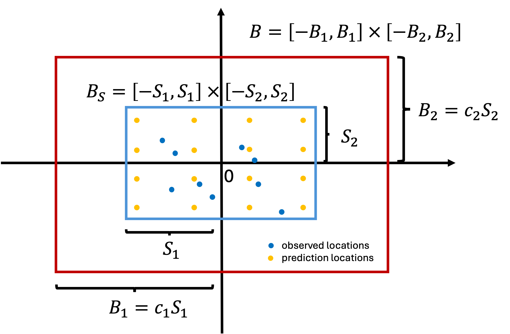
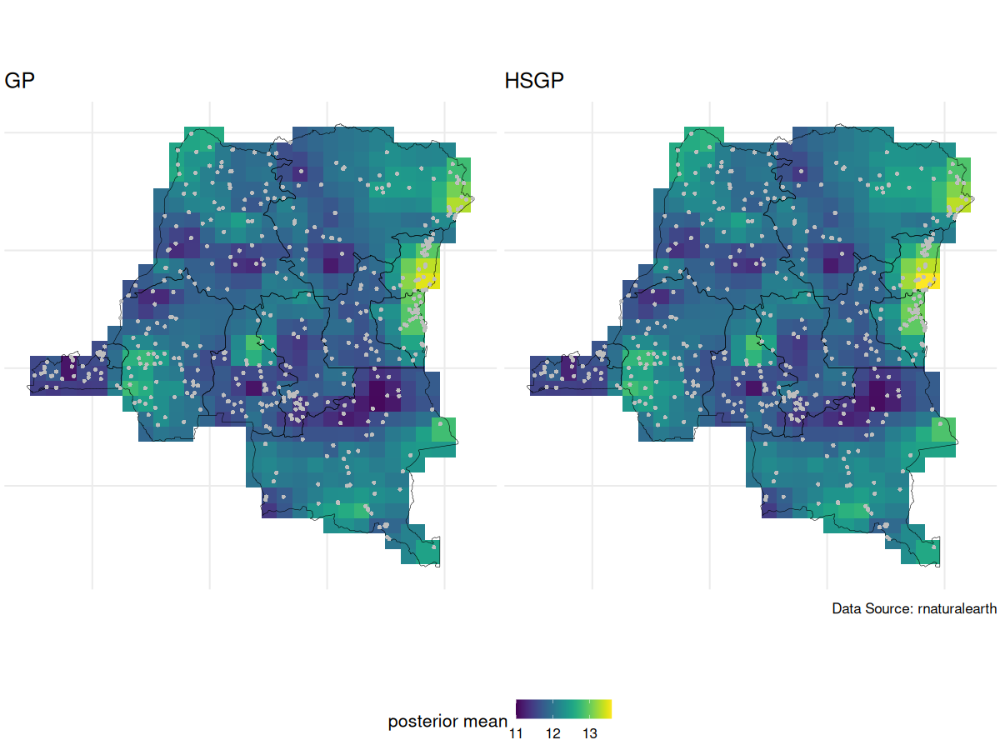
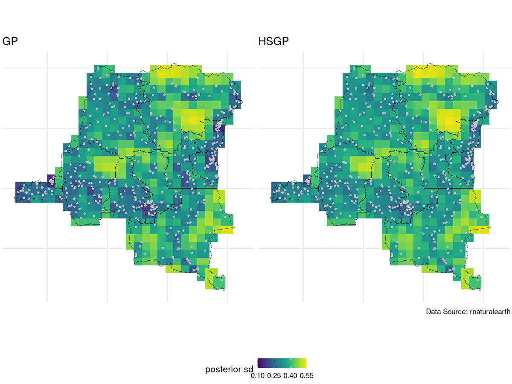
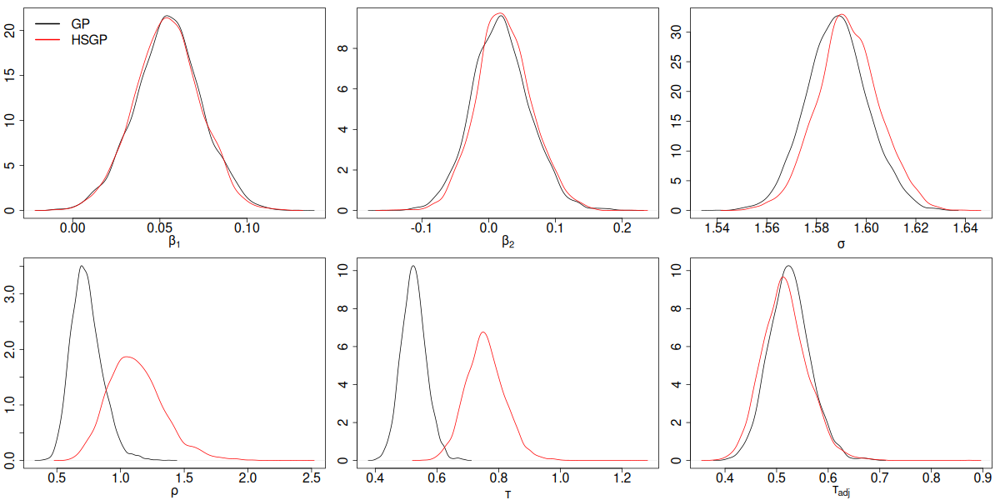
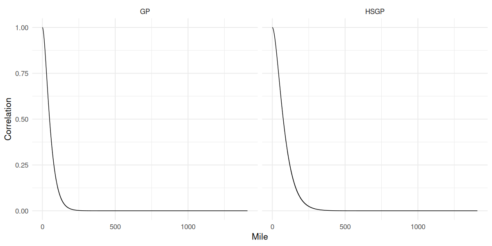
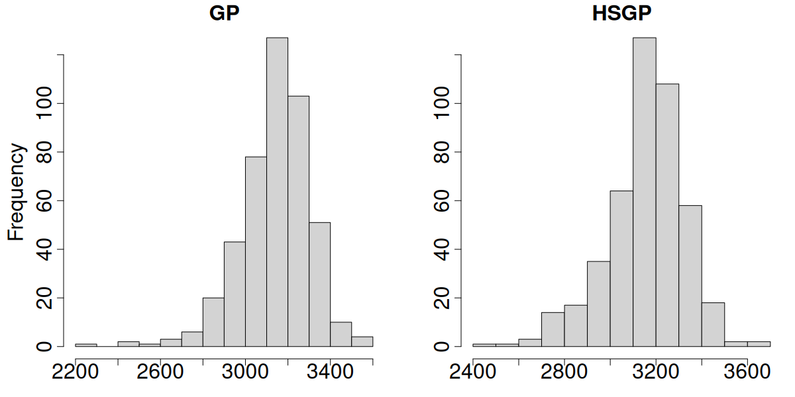

```{r, echo = FALSE, message = FALSE, warning = FALSE}
library(tidyverse)
library(sf)
library(rnaturalearth)
library(ggpubr)
```

```{r, echo = FALSE}
data <- read.csv(file = "/Users/sib2/Box Sync/Faculty/Education/biostat725-sp25/course-material/data/drc/hemoglobin_anemia.csv")
# data <- read.csv(file = "/Users/christineshen/Documents/Research/RA/20250221 STA725/hemoglobin_anemia.csv")
data <- data[complete.cases(data),-1]

# Convert to spatial dataset and merge DRC data
data_sf <- st_as_sf(data, coords = c("LONGNUM", "LATNUM"), crs = 4326)
congo_states_map <- ne_states(country = "Democratic Republic of the Congo", returnclass = "sf") %>%
  select(name,geometry)
# Ensure that the CRS for the country and grid points match
congo_states_map <- st_transform(congo_states_map, crs = 4326) 
data_sf_drc <- st_intersection(data_sf, congo_states_map)

```

## Geospatial analysis on hemoglobin dataset {.midi}

::: midi
We wanted to perform geospatial analysis on a dataset with \~8,600 observations at \~500 locations, and make predictions at \~440 locations on a grid.
:::

```{r}
#| echo: false
#| message: false
#| warning: false
#| fig-align: "center"
#| fig-width: 12
#| fig-height: 6

data_mean <- data %>%
  group_by(loc_id, urban, LATNUM, LONGNUM) %>%
  summarise(hemoglobin=mean(hemoglobin))
data_sf_whole <- st_as_sf(data_mean, coords = c("LONGNUM", "LATNUM"), crs = 4326)

# Extract bounding box coordinates
bbox <- st_bbox(congo_states_map)

latitudes <- seq(bbox["ymin"], bbox["ymax"], length.out = 30)
longitudes <- seq(bbox["xmin"], bbox["xmax"], length.out = 30)
grid_points <- expand.grid(lat = latitudes, long = longitudes)

# Convert the grid into an sf object
grid_sf <- st_as_sf(grid_points, coords = c("long", "lat"), crs = 4326)
in_drc <- st_within(grid_sf, congo_states_map, sparse = FALSE)
in_drc <- apply(in_drc,1,any)

grid_inside_drc <- grid_sf[in_drc, ]
p1 <- ggplot() +
  # Plot the map of DRC
  geom_sf(data = congo_states_map, fill = "lightblue", color = "black") +
  geom_sf(data = data_sf_whole, aes(color = hemoglobin), shape = 16, size = 2) +
  scale_color_viridis_b() + 
  # Customize the plot appearance
  theme_minimal() +
  labs(title = "Average Hemoglobin Across Communities DRC",
       caption = "",
       x = "Longitude", y = "Latitude", color = "Hemoglobin (g/dL)") 
p2 <- ggplot() +
  geom_sf(data = congo_states_map, fill = "lightblue", color = "black") +
  geom_sf(data = grid_inside_drc, color = "red", shape = 16, size = 1) +
  theme_minimal() +
  labs(title = "Grid of Points WITHIN DRC",
       caption = "Data Source: rnaturalearth",
       # subtitle = "Red points represent valid grid points inside DRC boundaries",
       x = "Longitude", y = "Latitude")

ggarrange(p1,p2,widths=c(1.3,1),ncol=2)
```

## Geospatial model {.midi}

We specify the following model: $$\mathbf{Y} = \alpha \mathbf{1}_{N} + \mathbf{X} \boldsymbol{\beta} + \mathbf{Z}\boldsymbol{\theta} + \boldsymbol{\epsilon}, \quad \boldsymbol{\epsilon} \sim N_N(\mathbf{0},\sigma^2\mathbf{I})$$ with priors

-   $\boldsymbol{\theta}(\mathbf{u}) | \tau,\rho \sim GP(\mathbf{0},C(\cdot,\cdot))$, where $C$ is the Matérn 3/2 covariance function with magnitude $\tau$ and length scale $\rho$
-   $\alpha^* \sim N(0,4^2)$. This is the intercept after centering $\mathbf{X}$.
-   $\beta_j | \sigma_{\beta} \sim N(0,\sigma_{\beta}^2)$, $j \in \{1,\dots,p\}$
-   $\sigma \sim \text{Half-Normal}(0, 2^2)$
-   $\tau \sim \text{Half-Normal}(0, 4^2)$
-   $\rho \sim \text{Inv-Gamma}(5, 5)$
-   $\sigma_{\beta} \sim \text{Half-Normal}(0, 2^2)$

## Review of the last lecture {.midi}

::: incremental
1.  Gaussian process (GP) is not scalable as it requires $\mathcal{O}(n^3)$ flops per MCMC iteration.

2.  Introduced HSGP, a Hilbert space low-rank approximation method for GP. $$\mathbf{C} \approx \boldsymbol{\Phi}\mathbf{S}\boldsymbol{\Phi}^T, \quad \text{where}$$

    -   feature matrix $\boldsymbol{\Phi} \in \mathbb{R}^{n \times m}$ only depends on the *approximation box* $B$ and observed locations.
    -   diagonal matrix $\mathbf{S} \in \mathbb{R}^{m \times m}$ only depends on the covariance function $C$ and its parameters $\tau$ and $\rho$.
    -   $m$ is the number of basis functions.

3.  Model reparameterization under HSGP: $\boldsymbol{\theta} \overset{d}{=} \boldsymbol{\Phi} \mathbf{S}^{1/2}\mathbf{b}$, $\mathbf{b} \sim N_m(0,\mathbf{I})$.

4.  How to do posterior sampling under HSGP in `stan`
:::

## Review of the last lecture {.midi}

::: incremental
5.  How to do kriging under HSGP in `stan`

    Under the reparameterized model, $\boldsymbol{\theta} = \boldsymbol{\Phi} \mathbf{S}^{1/2}\mathbf{b}$, where $\mathbf{b}$ is treated as the unknown parameter, and $S$ is known given $\tau$ and $\rho$. Therefore for kriging:

    $$\begin{align}
       \boldsymbol{\theta}^* \mid (\boldsymbol{\theta},\boldsymbol{\Omega}) &= \boldsymbol{\Phi}^*\mathbf{S}^{1/2}\mathbf{b} \mid (\mathbf{b},\boldsymbol{\Omega}) \\
       &=\boldsymbol{\Phi}^*\mathbf{S}^{1/2}\mathbf{b}.
     \end{align}$$
:::

::: fragment
During MCMC sampling, we can obtain posterior predictive samples for $\boldsymbol{\theta}^*$ through posterior samples of $\mathbf{b}$ and $\mathbf{S}$. Let superscript $(s)$ denote the $s$th posterior sample:

$$\boldsymbol{\theta}^{*(s)} = \boldsymbol{\Phi}^* \mathbf{S}^{(s) 1/2} \mathbf{b}^{(s)}.$$
:::

## Kriging under HSGP {.midi}

Under HSGP: $$\begin{align}
  \begin{bmatrix}
    \boldsymbol{\theta} \\
    \boldsymbol{\theta}^*
  \end{bmatrix} \Bigg| \boldsymbol{\Omega} \sim N_{n
  +q} \left(\begin{bmatrix}
    \mathbf{0}_n \\
    \mathbf{0}_q
  \end{bmatrix},
  \begin{bmatrix}
    \boldsymbol{\Phi}\mathbf{S}\boldsymbol{\Phi}^\top & \boldsymbol{\Phi}\mathbf{S} \boldsymbol{\Phi}^{*\top} \\
    \boldsymbol{\Phi}^*\mathbf{S}\boldsymbol{\Phi}^\top & \boldsymbol{\Phi}^*\mathbf{S}\boldsymbol{\Phi}^{*\top}
  \end{bmatrix} \right).
\end{align}
$$

If $m \le n$, we have shown $$\boldsymbol{\theta}^* \mid (\boldsymbol{\theta}, \boldsymbol{\Omega}) = (\boldsymbol{\Phi}^*\mathbf{S}\boldsymbol{\Phi}^\top) (\boldsymbol{\Phi}\mathbf{S}\boldsymbol{\Phi}^\top)^{\dagger} \boldsymbol{\theta}\overset{d}{=}\boldsymbol{\Phi}^*\mathbf{S}^{1/2}\mathbf{b}.$$

Now we show if $m>n$, $\boldsymbol{\theta}^* \mid (\boldsymbol{\theta}, \boldsymbol{\Omega}) \overset{d}{=}\boldsymbol{\Phi}^*\mathbf{S}^{1/2}\mathbf{b}.$

## HSGP parameters {.midi}

::: incremental
How to choose

-   number of basis functions $m$
-   the approximation box $B$
:::

::: fragment
@solin2020hilbert showed that HSGP approximation can be made arbitrarily accurate as $B$ and $m$ increase.
:::

:::: fragment
::: callout-important
## Our goal:

-   Minimize the run time while maintaining reasonable approximation accuracy.
-   Find smallest $B$ and $m$ that still yield reasonable approximation accuracy
:::
::::

## Number of basis functions {.midi}

::: incremental
-   For each dimension $l \in \{1,\dots,d\}$ of the Gaussian processes, we need to choose one number of basis functions $m_l$. The total number of basis functions is $m = \prod_{l=1}^d m_l$.
-   As a result, $m$, and hence the HSGP computation complexity $\mathcal{O}(nm+m)$ grows exponentially with $d$. Consequently, HSGP is typically recommended only for $d \le 3$, and at most $d=4$.
-   Increasing $m$ improves approximation accuracy but also increases computational cost.
:::

## HSGP approximation box {.midi}

::: incremental
-   Due to the design of HSGP, the approximation is less accurate near the boundaries of $B$.
-   How much the approximation accuracy deteriorates towards the boundaries depends on smoothness of the true surface.
-   The larger the length scale $\rho$, the smoother the surface, a smaller box can be used for the same level of boundary accuracy.
-   The larger the box, the more basis functions we need for the same level of overall accuracy, hence higher run time.
:::

## HSGP approximation box {.midi}

::: incremental
-   For ease of implementation, HSGP always centers all the coordinates.
-   Let $B_S$ denote the smallest box which contain all the observed and kriging locations. We need to ensure $B_S \subset B$.
:::

::: fragment
{fig-align="center" height="350"}
:::

## Relationship between $c$, $m$ and $\rho$ {.midi}

Let's quickly recap. For simplicity, let $d=1$,

::: incremental
-   As $\rho$ decreases, the surface is less smooth. $c$ needs to increase to retain boundary accuracy, $m$ needs to increase to retain overall accuracy.
-   As $c$ increases, $m$ needs to increase to retain overall accuracy.
-   As $m$ increases, run time increases.
:::

::: fragment
@riutort2023practical presented formulas for frequently used Matérn covariance functions:

-   given $\rho$, the minimum $c$ and $m$ needed
-   given $c$ and $m$, the minimum $\rho$ that can be captured

for a near 100% approximation accuracy of the **correlation matrix**.
:::

::: fragment
However, $\rho$ is unknown.
:::

## An iterative algorithm {.midi}

Pseudo-codes for HSGP parameter tuning assuming $d=1$.

```{r, eval=F, echo=T}

u = center(observed and prediction locations)
S = box size (u)
max_iter = 30

# initialization
j = 0
check = FALSE
diagnosis = logical(max_iter) # store checking results for each iteration

# initial guess
rho = 0.5*S # recommended initial value
c = minimum c given rho
m = minimum m given c, and rho
B = c*S

while (!check & j<=max_iter){
  
  fit = runHSGP(B,m) # stan run
  j = j + 1

  rho_hat = mean(fit$rho) # obtain fitted value for rho
  # check the fitted is larger than the minimum rho that can be well approximated
  diagnosis[j] = (rho_hat + 0.01 >= rho)
  if (j==1) {
    if (diagnosis[j]){
      # if the diagnosis check is passed, do one more run just to make sure
      m = m + 2
      update c using rho_hat
      update rho using m and c
    } else {
      # if the check failed, update our knowledge about rho
      rho = rho_hat
      update c and m using rho_hat
    }
  } else {
    if (diagnosis[j] & diagnosis[j-2]){
      # if the check passed for the last two runs, we finish tuning
      check = TRUE
    } else if (diagnosis[j] & !diagnosis[j-2]){
      # if the check failed last time but passed this time, do one more run
      m = m + 2
      update c using rho_hat
      update rho using m and c
    } else if (!diagnosis[j]){
      # if the check failed, update our knowledge about rho
      rho = rho_hat
      update c and m using rho_hat
    }
  }
  B = c*S
}
```

## HSGP implementation codes {.midi}

Please clone the repo for AE 08 for HSGP implementation codes.

## Side notes on HSGP implementation {.midi}

A few random things to keep in mind for implementation in practice:

::: incremental
1.  If $d>1$, parameter tuning is needed for each dimension.
2.  If your HSGP run is suspiciously VERY slow, check the number of basis functions being used in the run and make sure it is reasonable.
3.  Because HSGP is a low-rank approximation method, the GP magnitude parameter $\tau$ will always be overestimated. However, we can account for this and use a bias-adjusted $\tau$ instead. See AE 08 `stan` codes for parameter `tau_adj`.
4.  It is possible to use different length scale parameters for each dimension. See [demo codes here](https://github.com/gabriuma/basis_functions_approach_to_GP/tree/master/Paper) for examples.
5.  The iterative algorithm described in @riutort2023practical (i.e., pseudo-codes on slide 15) can be further improved
6.  Due to identifiability issues, always look at $\alpha \mathbf{1}+\boldsymbol{\theta}$ instead of $\boldsymbol{\theta}$ alone.
:::

## GP vs HSGP spatial intercept posterior mean {.midi}

{fig-align="center" height="600"}

## GP vs HSGP spatial intercept posterior SD {.midi}

{fig-align="center" height="600"}

## GP vs HSGP parameter posterior density {.midi}

{fig-align="center" height="550"}

## GP vs HSGP correlation function {.midi}

{fig-align="center" height="550"}

## GP vs HSGP effective sample size {.midi}

{fig-align="center" height="550"}

## Prepare for next class {.midi}

1.  Work on [HW 05](https://biostat725-sp26.netlify.app/hw/hw-05) which will be assigned shortly.
2.  Complete reading to prepare for Thursday's lecture
3.  Thursday's lecture: Disease Mapping

## References

::: {#refs}
:::
